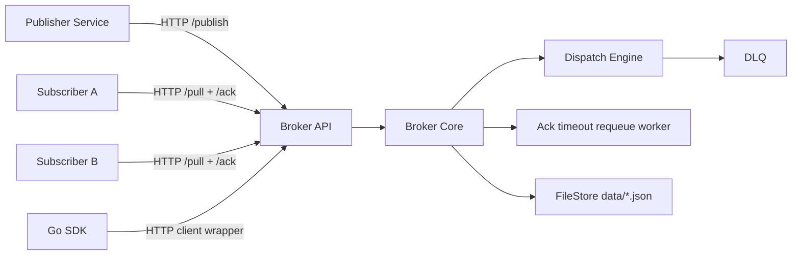

# Brocker - учебный брокер сообщений на Go

Собственная реализация брокера сообщений с поддержкой `pub/sub`, очередей, персистентности и SDK.

## Что реализовано

- Pub/Sub паттерн:
  - `topic`: каждый подписчик получает все сообщения.
  - `queue`: конкурирующие подписчики получают сообщения по одному (at-least-once).
- Очереди:
  - `fifo` и `lifo`.
- Множественные подписчики:
  - несколько подписчиков на один поток.
- Персистентность:
  - хранение состояния потоков в файловой системе (`data/*.json`);
  - восстановление после рестарта.
- Гарантия доставки:
  - `at-least-once` через `ack + retry`.
- SDK:
  - Go SDK в `sdk/go`.
- Дополнительно:
  - приоритет сообщений;
  - TTL сообщений;
  - DLQ (dead letter queue);
  - endpoint метрик (`/metrics`).

## Архитектура



## Структура проекта

- `cmd/broker` - HTTP сервер брокера.
- `cmd/publisher` - тестовый publisher.
- `cmd/subscriber` - тестовый subscriber (используется для A и B).
- `internal/broker` - доменная логика, доставка, персистентность.
- `internal/httpapi` - REST API слой.
- `sdk/go` - клиентская библиотека.
- `docker-compose.yml` - запуск всего стенда.

## Модель данных

### Stream
- `name`: имя потока.
- `type`: `topic | queue`.
- `queue_mode`: `fifo | lifo`.
- `messages[]`: хранимые сообщения.
- `subscribers`: состояние подписчиков.
- `available[]`: очередь доступных к выдаче сообщений (для queue).
- `in_flight`: сообщения, выданные и ожидающие ack.
- `dlq[]`: сообщения, попавшие в dead-letter.

### Message
- `id`: уникальный id.
- `payload`: строковый payload.
- `priority`: целое (больше = выше приоритет).
- `created_at`
- `expires_at` (опционально, TTL)

### Delivery (queue)
- `message_id`
- `subscriber`
- `attempts`
- `ack_deadline`

## REST API

### Создать stream
`POST /streams`
```json
{"name":"events","type":"queue","queue_mode":"fifo"}
```

### Подписаться
`POST /subscribe`
```json
{"stream":"events","subscriber":"subscriber-a"}
```

### Опубликовать
`POST /publish`
```json
{"stream":"events","payload":"hello","priority":2,"ttl_seconds":60}
```

### Получить сообщения
`POST /pull`
```json
{"stream":"events","subscriber":"subscriber-a","batch":1}
```

### Подтвердить сообщение
`POST /ack`
```json
{"stream":"events","subscriber":"subscriber-a","message_id":"..."}
```

### Метрики
`GET /metrics`

## Гарантия доставки

- Для `queue`:
  - сообщение считается доставленным только после `ack`;
  - если `ack` не пришел до `ack_deadline`, сообщение возвращается в очередь;
  - после `MAX_DELIVERIES` попадает в `DLQ`.
- Для `topic`:
  - у подписчика хранится offset, продвигается только по `ack`.

## Запуск локально

```bash
go run ./cmd/broker
```

В другом терминале:

```bash
go run ./cmd/publisher
go run ./cmd/subscriber
```

## Запуск через Docker Compose

```bash
docker compose up --build
```

Поднимутся:
- `broker` (порт `8080`)
- `publisher`
- `subscriber-a`
- `subscriber-b`


